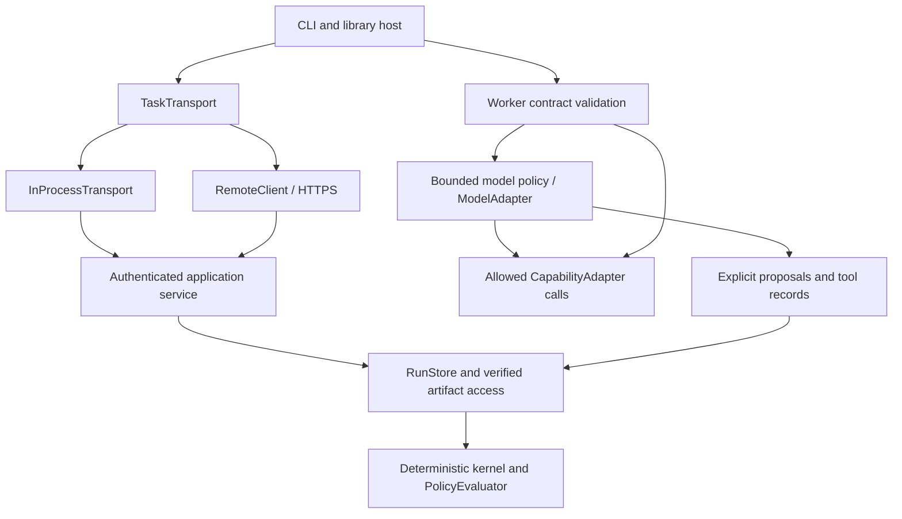

# R02 component and model execution acceptance

The workflow definition fixes node contracts, policy identities, legal edges and
gates. A host binding selects the model provider and implementation. Neither a
provider response nor a transport response can commit state directly. The run
store reconstructs the assigned request, checks its current ownership and
replays the explicit model record before accepting completion.

## Replaceable interfaces

| Component | Public interface | Implementations / consumers |
| --- | --- | --- |
| DefinitionRegistry | `workflow_definitions::DefinitionRegistry` | SQLite registry, CLI authoring |
| RunStore | `workflow_runstore::RunStore`, `ExecutionStore` | SQLite and PostgreSQL; local driver and authenticated service |
| ArtifactStore | `workflow_artifacts::ArtifactStore`, `ArtifactReader` | local files; assignment-scoped shared transfers and verified evidence |
| TaskTransport | `workflow_service::TaskTransport` | `InProcessTransport`, `RemoteClient`; scheduler, task and effect worker loops |
| Worker | `workflow_worker::Worker` | checked adapter registry shared by standalone, local and remote execution |
| ModelAdapter | `workflow_models::ModelAdapter` | deterministic fixture, OpenAI Responses, Anthropic Messages |
| CapabilityAdapter | `workflow_worker::CapabilityAdapter` | built-in compiler tools and host-registered implementations |
| PolicyEvaluator | `workflow_gates::PolicyEvaluator` | `DeterministicPolicyEvaluator`; durable mandatory postconditions |



The core crate dependency graph is in [the architecture guide](roadmap.md).
Provider implementations are absent from the kernel's dependencies. The kernel
uses portable model record validation, without invoking a provider during replay.

`InProcessTransport::new(service, credential_ref)` accepts the same versioned
`Request` as `RemoteClient`. Both enforce request bounds, response matching and
credential shape, reread credentials per call, redact application error details,
and perform no automatic mutation replay. Both invoke `Request::execute` and the
same scoped authenticated service. The in-process adapter still uses the shared
authority store; standalone SQLite execution remains available through the
`ExecutionStore` driver. Changing transport does not turn a worker into a trusted
state writer or bypass revoked credentials.

## Version and permission compatibility

| Surface | Supported version and negotiation rule |
| --- | --- |
| HTTPS / in-process application envelope | version 1, rejected before dispatch otherwise |
| Direct worker request/grant/result | version 1, advertised by `capability list` |
| Model worker request/grant/result | version 2, advertised by `model check-policy`; exact policy binding and explicit record required |
| Model policy/proposal/record | schema 1; unknown proposal actions and fields are rejected |
| Capability | exact ID, pinned version and descriptor digest; semantic changes require a new version |

Selection is explicit capability advertisement followed by exact-version
acceptance, with no silent downgrade. Deploy a model-capable server and worker
before assigning protocol 2 work. An old direct-only worker cannot fulfill it.
The envelope remains version 1 because its operation and response shapes already
carry worker protocol 2. The new optional `CapabilityRule.model_policy` is
required for model assignments; ordinary capability grants no longer imply a
model-policy grant. Older provisioning binaries reject the new field. Existing
direct grants retain their serialized representation and meaning.

Use the `task_contract_digest` and `binding` returned by `model check-policy` to
provision the worker rule. The policy digest binds its goal, allowed tools,
complete contracts and budgets. Providers, endpoints and secret references remain
host configuration. A different provider binding never changes the business
bundle. The [model guide](model-execution.md) has local and remote commands.

Models can dynamically call only the read-only contracts explicitly allowed by
their current policy. Declared write contracts cannot be registered as model
tools. Models cannot request another node's transition or skip an UNKNOWN gate. Write nodes use the
separate [durable effect protocol](remote-effects.md), with their frozen target,
principal, input, lease and effect permissions checked for every call. A model
result can supply typed data to a declared subsequent node; it is not an effect
grant. Arbitrary nested write tools are intentionally refused: no crash-safe
intermediate model session is claimed. Adapter declarations are a trusted host
boundary; [R14](security-acceptance.md) specifies the registered executor and
workspace isolation boundary, and the requirements for privileged custom adapters.

## Acceptance evidence

| Issue criterion | Executable evidence |
| --- | --- |
| Same workflow, two model adapters and deterministic executor | `https_model_bindings_records_failures_and_policy_authority_contract` executes the unchanged business bundle with the fake adapter and both HTTP wire adapters; provider differences are confined to worker bindings |
| Same standalone and workflow capability contract | the same test compares standalone validation output with the model tool/workflow output; worker tests cover exact node/descriptor matching |
| Same local and remote transport cases | the entire model contract runs over both `InProcessTransport` and real HTTPS, including authenticated dispatch, process-separated workers, result settlement and reopening |
| Invalid result/protocol/capability/transition rejected | transport version denial, model-policy grant denial without run mutation, missing-record rejection, illegal proposal fixture, missing-tool/changed-contract worker and model tests |
| Provider outage isolated from committed state | 503 produces a recorded model failure; earlier committed runs remain equal after reopening; standalone deterministic capability execution still succeeds; recovery makes zero additional provider calls |
| Dependency graph, protocol and replacement example | interface table and graph above; [worker protocol](worker-protocol.md); `examples/models/{openai,anthropic}.json` and the executable CLI example below |

The same matrix also checks wrong worker access, credential revocation, unchanged
policy identity, equal typed outputs, preserved visible decisions/tool results,
and absence of credentials or hidden-reasoning fixture content in durable images.
SQLite tests separately prove lease fencing, immutable policy versions, exact
record replay and preservation of mandatory UNKNOWN postconditions.

```sh
cargo test -p workflow-worker -p workflow-models -p workflow-model-http -p workflow-gates --locked
cargo test -p workflow-runstore-sqlite --locked models
# WORKFLOW_TEST_POSTGRES must refer to a disposable database.
cargo test -p workflow-service --locked https_model_bindings_records_failures_and_policy_authority_contract -- --ignored --nocapture
cargo build -p workflow-cli --locked
python3 examples/models/https-cli.py target/debug/workflow
```

The CLI example provisions a unique tenant, launches a real TLS service and local
provider wire fixtures, issues exact policy grants, then runs `remote work-models`
with each provider binding. It asserts equal business outputs and four observed
provider calls, reporting **zero business definition changes** and the tested
binary digest. Rust CI runs the unit contracts; PostgreSQL CI runs the transport
matrix and executable CLI example. Full repository gates also include Clippy,
formatting, workspace tests and Bazel.

These are deterministic protocol and authority measurements. They do not measure
live provider availability, model quality, provider billing or human integration
time. Those operational evaluations can use the same binding interfaces without
changing the workflow definition.

<!-- book-navigation -->

[Contents](README.md) · [中文](zh/model-boundaries-acceptance.md) · [Previous: Definition acceptance](definition-acceptance.md) · [Next: Approval acceptance](approval-acceptance.md)

<!-- /book-navigation -->
