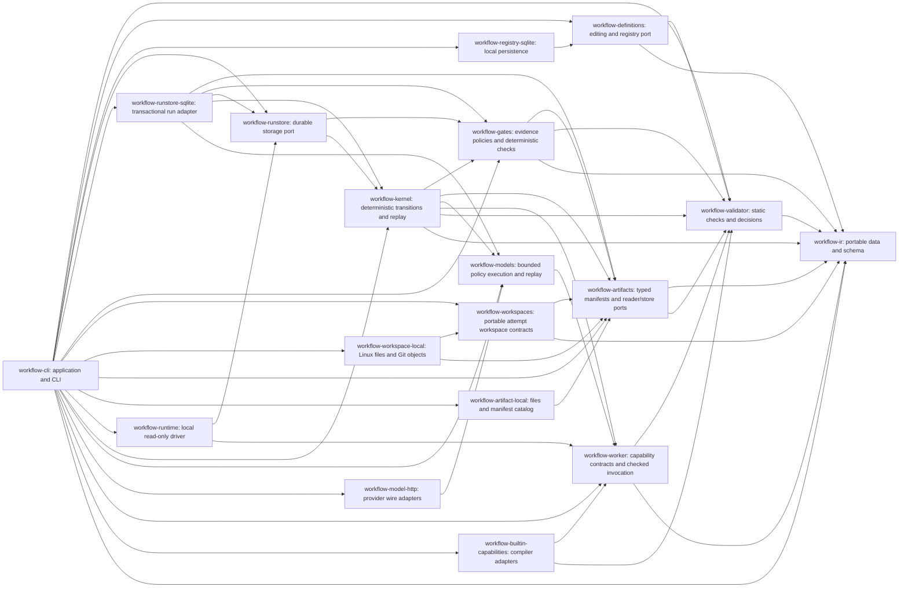

# Workflow architecture and delivery

The product owns portable business process contracts, legal state transitions,
explicit evidence and durable execution ownership. Models propose node-local
decisions; capabilities perform work; Skills document correct use of those
capabilities over their CLIs. Provider SDKs and databases stay in adapters.

These are independent Rust libraries with explicit Bazel targets. Model and capability adapters depend on stable contracts;
the IR must remain free of those implementations. Cargo and Bazel compile the same
source files and external dependency lock. Rust and Bazel versions are pinned.

## Issue sequence

Each MR must state the accepted portion of its issue, tests, and remaining work.
An issue closes only when all of its acceptance criteria have evidence. The
research umbrella remains the full roadmap; finishing the compiler is not
completion of the workflow runtime.

| Issues | Delivery |
| --- | --- |
| [R01 #2](https://github.com/coolplayagent/workflow-cli/issues/2) | Delivered: IR, static validation, decisions, examples, optimistic draft/node/edge CRUD, semantic diff, immutable publishing and history. Also delivered: deterministic control flow, capability/subworkflow bundle checks, immutable run binding and checkpoint replay. Also delivered: frozen model policy resolution and local durable dispatch. Next: remaining full-runtime acceptance evidence. |
| [R02 #4](https://github.com/coolplayagent/workflow-cli/issues/4) | Delivered: capability descriptors/adapter port, protocol 1 request/grant/result validation, standalone and node invocation of read-only compiler capabilities. Also delivered: bounded model/tool loop, protocol 2 policy/record binding, explicit record replay, OpenAI Responses/Anthropic Messages adapters and same-bundle replacement fixtures. Next: live provider evaluation, authenticated remote transport, remaining execution ports and authenticated remote transport. Durable effect dispatch and HTTP gateway query recovery are implemented; ordered compensation remains pending. |
| [R15 #3](https://github.com/coolplayagent/workflow-cli/issues/3) | Incremental deterministic invariant checks alongside modules; independent business baseline and fault experiments remain open. |
| [R04 #5](https://github.com/coolplayagent/workflow-cli/issues/5), [R05 #6](https://github.com/coolplayagent/workflow-cli/issues/6) | Kernel state/event/command contracts and cancellation/reconciliation transitions delivered. Also delivered: RunStore port, SQLite atomic state/event/checkpoint/outbox commits, ordered delivery receipts, persistent CLI, CAS/crash/corruption/full-disk tests. Also delivered: run leases, epoch fencing, durable attempts, atomic result/event/receipt commits, bounded read-only retries and explicit storage migration; artifact evidence is verified before completion and during recovery. Also delivered: durable pause/resume admission, in-flight result draining and original-deadline recovery. Also delivered: frozen write policies, durable effect intent/receipt ledger, provider query recovery, bounded backoff, manual reconciliation and HTTP crash/duplicate tests. Next: explicit ordered compensation, distributed storage/transport, autonomous timers and backup/restore. |
| [R07 #7](https://github.com/coolplayagent/workflow-cli/issues/7), [R11 #8](https://github.com/coolplayagent/workflow-cli/issues/8) | Delivered: typed artifact manifests, exact producer/input/source provenance, local atomic upload, retention-safe orphan cleanup, lineage/impact, portable local export/import and run evidence verification. Also delivered: attempt-bound workspace contracts, independent committed-file exports, current file observation, typed output capture and explicit merge policy. Next: automatic execution/gate workspace binding, sandboxing, resource/merge execution, authenticated remote storage and controlled invalidation; immutable versions and migrations. |
| [R03 #10](https://github.com/coolplayagent/workflow-cli/issues/10), [R06 #11](https://github.com/coolplayagent/workflow-cli/issues/11) | Delivered: portable PASS/FAIL/UNKNOWN checker with exact policy/target/tool/input bindings, settled execution provenance and read-only CLI revalidation. Also delivered: frozen mandatory task/terminal postconditions, fenced decision commits and replay, durable UNKNOWN retry and declared bounded repair. Also delivered: durable callback Inbox, early/pause buffering, exact target/input matching and transactional deduplication. Next: effect authorization, current-workspace verification, authenticated approval policy and autonomous wakeups. |
| [R08 #12](https://github.com/coolplayagent/workflow-cli/issues/12) | Delivered: explicit local read-only drive with real built-in capability results and durable pause/resume controls. Next: broader adapters, autonomous operation and backup/restore. |
| [R09 #13](https://github.com/coolplayagent/workflow-cli/issues/13), [R14 #9](https://github.com/coolplayagent/workflow-cli/issues/9) | Local run ownership and epoch fencing foundation delivered; cluster leasing, fairness, tenant identity and secrets remain open. |
| [R10 #15](https://github.com/coolplayagent/workflow-cli/issues/15), [R12 #16](https://github.com/coolplayagent/workflow-cli/issues/16), [R13 #14](https://github.com/coolplayagent/workflow-cli/issues/14) | Hybrid deployment, cost/observability and composable SDLC templates. |
| [R16 #17](https://github.com/coolplayagent/workflow-cli/issues/17) | Offline candidate learning with held-out evaluation and mandatory-gate preservation. |

## R01 acceptance evidence

| Requirement | Evidence and remaining boundary |
| --- | --- |
| Shared versioned JSON/YAML/builder IR | `workflow-ir` round-trip, digest and type tests; generated JSON Schema checked against source |
| Review, parallel tests, bounded repair, rejection examples | Compiler fixtures plus five CLI replay scenarios and kernel outcome tests; external task results in scenarios are simulated |
| Unknown refs, cycles, reachability, bounds and input types | Negative validator and bundle tests; contracts and references resolved inside the supplied bundle, external adapter availability remains a host check |
| Condition missing/type/multiple/no match | Deterministic evaluator and kernel tests, including join failure/skip/cancel and missing actual values |
| Same validation at local/remote boundary | Serialized request parity test; actual remote transport is R02 |
| Edits, optimistic conflicts, publishing, semantic diff | `workflow-definitions` and SQLite adapter tests; complete CLI authoring loop; OS process race and interrupted transaction recovery. Bundle checks and definition/capability digests lock kernel runs; durable registry-to-run transactions remain open. |
| Capability binding boundary | `workflow-worker` checks exact capability version/digest, node input/output contract and preconditions; built-in compiler capabilities run standalone and through a prepared node request. Kernel checks supplied bundles and reduces trusted host events; SQLite run commits are implemented; local run ownership and read-only dispatch are implemented; authenticated ingress remains open. |
| Control-flow runtime | `workflow-kernel` tests sequence, decisions, all/any, waits, subworkflow values and bounded loops; checkpoint restore preserves deadlines and instance identity. SQLite run storage persists those transitions; local read-only dispatch is covered by real built-in execution tests. |
| Business benefit | Not measured; no percentage or SLA claims |

## R04 first increment evidence

The [run storage guide](run-store.md) specifies the RunStore port, SQLite contract
and tested crash model. Atomic start/apply/receipt transactions, immutable binding
locks, event deduplication, CAS, retained waits/loop frames and complete recovery
have contract tests. Independent processes are terminated around commits; SQLite
full-disk/read-only failures never emit success. Checkpoint-plus-tail, complete
history, current state and every outbox intent are compared during recovery.

The [local execution guide](local-execution.md) adds run leases, attempts, epoch
fencing, bounded read-only retry and atomic result settlement. Effect/artifact
ledgers, autonomous timers, general retry policy, backup/restore and
retention are still required before R04 closes. Process
recovery evidence does not establish whole-disk disaster recovery or RPO/RTO.

## R07 artifact increment evidence

The [artifact guide](artifacts.md) defines portable manifest identity, typed content,
exact producer provenance and retained input dependencies. Local publication syncs
content before manifest commit and uses the same catalog lock as orphan cleanup.
Process-kill tests cover partial upload through post-commit recovery; concurrent
publishers deduplicate without overwriting, and storage failures never confirm an
artifact. A real CLI worker result can commit a checked report, then recover using
identical references in a relocated store. Missing/corrupt dependencies and wrong
input provenance reject. Lineage/impact queries identify affected downstream
producers without rewriting history. This does not complete isolated workspaces,
remote object storage/authentication or controlled recomputation acceptance.

## R03 evidence checker increment

The [evidence checker guide](evidence-gates.md) defines exact requirements, target
bindings, source obligations and exclusive freshness windows. Core and real CLI
tests reject stale/missing/uncommitted/mismatched evidence and fabricated decision
fields; actual false compiler output remains FAIL even with a report claiming
true. Standalone evaluation does not advance a run or authorize an effect.

The [runtime postcondition increment](runtime-postconditions.md) freezes mandatory
task/terminal contracts in run bundles, checks settled evidence before successor
release, commits decisions under a lease and rechecks proofs on recovery. UNKNOWN
is durable and idle until explicit retry; confirmed FAIL enters declared bounded
repair. Tests cover three-round exhaustion/deadlines, raw ingress rejection,
precommit expiry rollback, process races/crashes and migration. R03 remains open
for workspace verification, atomic external action consumption, human exceptions
and final acceptance manifests.

## R07 attempt workspace increment

The [workspace guide](workspaces.md) defines attempt identity, fixed Git object
verification, independent writable files, deterministic observations and typed
output capture. The real CLI example proves allocated bytes equal the prepared
validator inputs, settles captured evidence and completes both existing gates.
Concurrent process allocation, crash cleanup, object corruption and SQLite
capacity tests exercise the failure boundary. Directory isolation is not an OS
sandbox; automatic run/gate binding, shared-resource coordination, merging and
remote authorization remain open.

## R02 model policy increment evidence

[Model execution](model-execution.md) defines the policy, provider binding, protocol 2
and explicit replay boundary. The portable executor constrains tools and outputs;
the provider adapter owns HTTP and credential lookup. Loopback HTTP tests run the
same business bundle with both provider formats and actual compiler tools. Durable
settlement rejects missing/tampered records, stale owners and raw success events;
recovery makes no model calls and mandatory gates retain UNKNOWN for absent evidence.
An actual schema 4 database was upgraded to 5 with identical snapshot/execution
history and verified rejection by the old reader. No live provider, model-quality,
exactly-once billing or run-wide monetary budget claim is made. R02 remains open.

### Effect ledger increment

`workflow-effects` owns the provider-independent ledger; `workflow-effect-http`
implements explicit gateway dispatch, with both crates exported as Rust libraries
for Cargo and Bazel. [The effect contract](durable-effects.md) describes tested
local behavior and pending R05 acceptance. Tests prove fixture deduplication at
the sandbox provider boundary; they do not establish global exactly-once effects.
