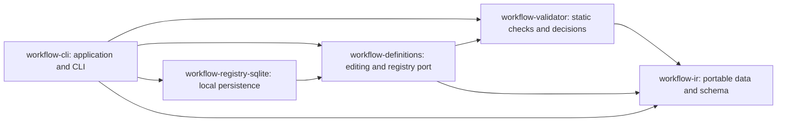

# Workflow architecture and delivery

The product owns portable business process contracts, legal state transitions,
explicit evidence and durable execution ownership. Models propose node-local
decisions; capabilities perform work; Skills document correct use of those
capabilities over their CLIs. Provider SDKs and databases stay in adapters.

These are independent Rust libraries with explicit Bazel targets. Future runtime,
registry, storage, model and capability adapters will depend on stable contracts;
the IR must remain free of those implementations. Cargo and Bazel compile the same
source files and external dependency lock. Rust and Bazel versions are pinned.

## Issue sequence

Each MR must state the accepted portion of its issue, tests, and remaining work.
An issue closes only when all of its acceptance criteria have evidence. The
research umbrella remains the full roadmap; finishing the compiler is not
completion of the workflow runtime.

| Issues | Delivery |
| --- | --- |
| [R01 #2](https://github.com/coolplayagent/workflow-cli/issues/2) | Delivered: IR, static validation, decisions, examples, optimistic draft/node/edge CRUD, semantic diff, immutable publishing and history. Next: executable control-flow semantics and complete capability/subworkflow bundle resolution. |
| [R02 #4](https://github.com/coolplayagent/workflow-cli/issues/4) | Provider-neutral execution ports, versioned worker protocol, standalone and workflow capability invocation, model replacement examples. |
| [R15 #3](https://github.com/coolplayagent/workflow-cli/issues/3) | Incremental deterministic invariant checks alongside modules; independent business baseline and fault experiments remain open. |
| [R04 #5](https://github.com/coolplayagent/workflow-cli/issues/5), [R05 #6](https://github.com/coolplayagent/workflow-cli/issues/6) | Durable state/events/outbox; effects, retries, reconciliation and compensation. |
| [R07 #7](https://github.com/coolplayagent/workflow-cli/issues/7), [R11 #8](https://github.com/coolplayagent/workflow-cli/issues/8) | Artifact provenance and workspace isolation; immutable versions and migrations. |
| [R03 #10](https://github.com/coolplayagent/workflow-cli/issues/10), [R06 #11](https://github.com/coolplayagent/workflow-cli/issues/11) | Evidence gates, approvals and asynchronous durable waits. |
| [R08 #12](https://github.com/coolplayagent/workflow-cli/issues/12) | Single-machine execution and backup/restore. |
| [R09 #13](https://github.com/coolplayagent/workflow-cli/issues/13), [R14 #9](https://github.com/coolplayagent/workflow-cli/issues/9) | Cluster leasing, fencing, fairness, tenant identity and secrets. |
| [R10 #15](https://github.com/coolplayagent/workflow-cli/issues/15), [R12 #16](https://github.com/coolplayagent/workflow-cli/issues/16), [R13 #14](https://github.com/coolplayagent/workflow-cli/issues/14) | Hybrid deployment, cost/observability and composable SDLC templates. |
| [R16 #17](https://github.com/coolplayagent/workflow-cli/issues/17) | Offline candidate learning with held-out evaluation and mandatory-gate preservation. |

## R01 acceptance evidence

| Requirement | Evidence and remaining boundary |
| --- | --- |
| Shared versioned JSON/YAML/builder IR | `workflow-ir` round-trip, digest and type tests; generated JSON Schema checked against source |
| Review, parallel tests, bounded repair, rejection examples | Four JSON examples and equivalent review YAML pass the same compiler; runtime outcome tests remain pending |
| Unknown refs, cycles, reachability, bounds and input types | Negative validator tests; external capability/subworkflow availability belongs to registry resolution |
| Condition missing/type/multiple/no match | Deterministic evaluator tests; join failure/skip/cancel tests remain pending |
| Same validation at local/remote boundary | Serialized request parity test; actual remote transport is R02 |
| Edits, optimistic conflicts, publishing, semantic diff | `workflow-definitions` and SQLite adapter tests; complete CLI authoring loop; OS process race and interrupted transaction recovery. External bundle resolution and run version locking remain open. |
| Business benefit | Not measured; no percentage or SLA claims |
