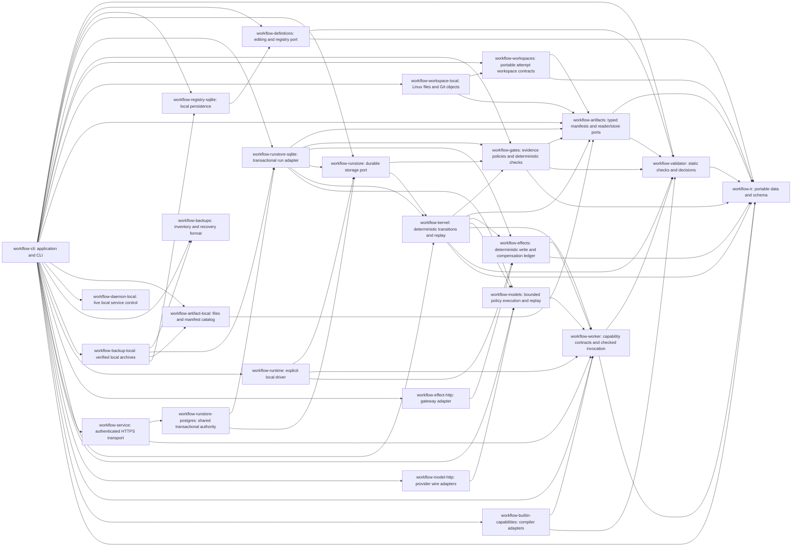

# Workflow architecture and delivery

The product owns portable business process contracts, legal state transitions,
explicit evidence and durable execution ownership. Models propose node-local
decisions; capabilities perform work; Skills document correct use of those
capabilities over their CLIs. Provider SDKs and databases stay in adapters.

These are independent Rust libraries with explicit Bazel targets. Model and capability adapters depend on stable contracts;
the IR must remain free of those implementations. Cargo and Bazel compile the same
source files and external dependency lock. Rust and Bazel versions are pinned.

## Issue sequence

Each MR must state the accepted portion of its issue, tests, and remaining work.
An issue closes only when all of its acceptance criteria have evidence. The
research umbrella remains the full roadmap; finishing the compiler is not
completion of the workflow runtime.

| Issues | Delivery |
| --- | --- |
| [R01 #2](https://github.com/coolplayagent/workflow-cli/issues/2) | Delivered: IR, static validation, decisions, examples, optimistic draft/node/edge CRUD, semantic diff, immutable publishing and history. Also delivered: deterministic control flow, capability/subworkflow bundle checks, immutable run binding and checkpoint replay. Also delivered: frozen model policy resolution and local durable dispatch. Also delivered: shared bounded compiler reports, real HTTPS diagnostic parity, immutable remote publication before first start, and reproducible R01 acceptance baselines; see the definition acceptance guide. |
| [R02 #4](https://github.com/coolplayagent/workflow-cli/issues/4) | Delivered: capability descriptors/adapter port, protocol 1 request/grant/result validation, standalone and node invocation of read-only compiler capabilities. Also delivered: bounded model/tool loop, protocol 2 policy/record binding, explicit record replay, OpenAI Responses/Anthropic Messages adapters and same-bundle replacement fixtures. Also delivered: exact model-policy credential grants, remote model CLI, shared TaskTransport for in-process/HTTPS execution, PolicyEvaluator and the ten-case model transport matrix. Local/remote durable effect execution uses separate effect grants. See [R02 acceptance](model-boundaries-acceptance.md); sandbox protocol fixtures do not claim live-model quality or cost measurements. |
| [R15 #3](https://github.com/coolplayagent/workflow-cli/issues/3) | Incremental deterministic invariant checks alongside modules; independent business baseline and fault experiments remain open. |
| [R04 #5](https://github.com/coolplayagent/workflow-cli/issues/5) | Kernel state/event/command contracts and cancellation/reconciliation transitions delivered. Also delivered: RunStore port, SQLite atomic state/event/checkpoint/outbox commits, ordered delivery receipts, persistent CLI, CAS/crash/corruption/full-disk tests. Also delivered: run leases, epoch fencing, durable attempts, atomic result/event/receipt commits, bounded read-only retries and explicit storage migration; artifact evidence is verified before completion and during recovery. Also delivered: durable pause/resume admission, in-flight result draining and original-deadline recovery. Also delivered: frozen write policies, durable effect intent/receipt ledger, provider query recovery, bounded backoff, manual reconciliation and HTTP crash/duplicate tests. Also delivered: explicit ordered compensation, original receipt binding, irreversible contracts and durable manual takeover after failed undo. Also delivered: consistent local backup, retained artifacts/definitions, restored ownership generations and query/import of post-backup effects. Also delivered: optional local daemon and durable timer scans. Shared PostgreSQL authority and authenticated HTTPS transport are implemented for read-only tasks. Also delivered: authenticated effect dispatch, provider query recovery and audited reconciliation. Also delivered: full PostgreSQL archive/restore acceptance, atomic dependency validation, old-credential revocation, fresh ownership generations and authenticated post-backup effect import. See [R04 acceptance](shared-recovery.md). |
| [R05 #6](https://github.com/coolplayagent/workflow-cli/issues/6) | Delivered: local and authenticated shared effect execution, stable keys, durable intent/receipt commits, query-first recovery, bounded retries, ordered compensation and audited manual takeover. The [remote effect acceptance guide](remote-effects.md) maps every R05 criterion to local and real PostgreSQL/HTTPS fault evidence. Provider guarantees remain explicit; no global exactly-once claim. |
| [R07 #7](https://github.com/coolplayagent/workflow-cli/issues/7) | Delivered: typed/provenance-bound artifacts, atomic local and S3 publication, shared PostgreSQL object catalog, scoped expiring downloads, retained lineage and crash-safe orphan cleanup. Actual task execution allocates independent workspaces, records executable/tool identity and captures typed evidence before settlement. Sealed proposals support reviewed conflict selection, a new verified Git revision and fresh gate evidence; replacement plans reject stale transitive evidence while retaining history. See [R07 acceptance](artifact-acceptance.md). |
| [R11 #8](https://github.com/coolplayagent/workflow-cli/issues/8) | Delivered: immutable version routing; explicit paused-run migration with reviewed impact, fresh instances/evidence/approvals, timer conversion and fenced atomic commits; historical replay under retained versions; verified local backup/storage upgrade and scoped shared-image conversion. Real process crashes, PostgreSQL/HTTPS, CLI and retained-binary recovery are covered by [R11 acceptance](version-migration.md). |
| [R03 #10](https://github.com/coolplayagent/workflow-cli/issues/10) | Delivered: portable PASS/FAIL/UNKNOWN checker with exact policy/target/tool/input bindings, settled execution provenance and read-only CLI revalidation. Also delivered: frozen mandatory task/terminal postconditions, fenced decision commits and replay, durable UNKNOWN retry and declared bounded repair. Also delivered: durable callback Inbox, early/pause buffering, exact target/input matching and transactional deduplication. Also delivered: action-specific gate consumption, current-workspace verification, scoped human exceptions and final acceptance manifests. See [R03 acceptance](release-acceptance.md). |
| [R06 #11](https://github.com/coolplayagent/workflow-cli/issues/11) | Frozen responder/subject/validity and exception policies, distinct authenticated human/event roles, durable Inbox and timers, rework invalidation, replay and local/PostgreSQL/HTTPS fault coverage. See [R06 acceptance](approval-acceptance.md). |
| [R08 #12](https://github.com/coolplayagent/workflow-cli/issues/12) | Delivered: explicit local read-only drive with real built-in capability results and durable pause/resume controls. Also delivered: verified local backup/restore, moved paths, old-lease fencing and explicit external-effect recovery holds. Also delivered: optional queryable/stoppable local daemon, restart/suspend recovery, concurrent CLI ownership tests and a full offline branch/loop/parallel/approval example. Independent environment verification is retained with the daemon MR. |
| [R14 #9](https://github.com/coolplayagent/workflow-cli/issues/9) | Delivered for registered builtin/model/effect execution: authenticated tenant/project/actor and role boundaries, exact worker grants, assignment-bound short-lived provider credentials with live rotation, known-credential reflection rejection, scoped private audit export, protected artifact downloads, isolated workspaces and explicit retention/archive/deletion policy. Real PostgreSQL/HTTPS and provider acceptance includes cross-scope and malicious-output negatives. See [R14 acceptance](security-acceptance.md). |
| [R09 #13](https://github.com/coolplayagent/workflow-cli/issues/13) | Delivered: PostgreSQL authority, primary database time, immutable bindings, scoped identities/roles, revocation/audit and task assignment. Authenticated HTTPS and host secret references connect separate schedulers/workers; a two-scheduler/three-worker fault test proves higher-epoch takeover, stale-result rejection and local/remote business-state parity. Also delivered: bounded lease renewal, shared quotas/backpressure, worker routing/drain and fault takeover. See [R09 acceptance](cluster-scheduling.md) for the complete tested scheduling boundary; production performance remains a separate measurement. R14 security boundaries are documented separately. Authenticated effect dispatch/reconciliation and typed pause/resume/cancel are implemented. |
| [R13 #14](https://github.com/coolplayagent/workflow-cli/issues/14) | [Reviewed SDLC templates](reviewed-templates.md): portable definitions, independent owner publication, pure plans and local/TLS regression artifacts. |
| [R10 #15](https://github.com/coolplayagent/workflow-cli/issues/15), [R12 #16](https://github.com/coolplayagent/workflow-cli/issues/16) | Hybrid deployment and cost/observability. |
| [R16 #17](https://github.com/coolplayagent/workflow-cli/issues/17) | Offline candidate learning with held-out evaluation and mandatory-gate preservation. |

## R01 acceptance evidence

The [definition acceptance guide](definition-acceptance.md) gives exact commands,
coverage and measurement limits.

| Requirement | Evidence and remaining boundary |
| --- | --- |
| Shared versioned JSON/YAML/builder IR | `workflow-ir` round-trip, digest and type tests; generated JSON Schema checked against source |
| Review, parallel tests, bounded repair, rejection examples | Compiler fixtures plus five CLI replay scenarios and kernel outcome tests; external task results in scenarios are simulated |
| Unknown refs, cycles, reachability, bounds and input types | Negative validator and bundle tests; contracts and references resolved inside the supplied bundle, external adapter availability remains a host check |
| Condition missing/type/multiple/no match | Deterministic evaluator and kernel tests, including join failure/skip/cancel and missing actual values |
| Same validation at local/remote boundary | 18-case real HTTPS/PostgreSQL diagnostic matrix, executable CLI byte parity, and builtin workflow execution parity over authenticated HTTPS |
| Edits, optimistic conflicts, publishing, semantic diff | `workflow-definitions` and SQLite adapter tests; complete CLI authoring loop; OS process race and interrupted transaction recovery. Bundle checks and definition/capability digests lock kernel runs; remote publication freezes the same immutable version identities before first start; shared remote draft CRUD remains a separate authoring extension. |
| Capability binding boundary | `workflow-worker` checks exact capability version/digest, node input/output contract and preconditions; built-in compiler capabilities run standalone and through a prepared node request. Kernel checks supplied bundles and reduces trusted host events; SQLite run commits are implemented; local run ownership and read-only dispatch are implemented; authenticated assignment/result ingress, remote artifact ingress and remote effect execution are implemented; authenticated remote model execution and exact policy grants are implemented. |
| Control-flow runtime | `workflow-kernel` tests sequence, decisions, all/any, waits, subworkflow values and bounded loops; checkpoint restore preserves deadlines and instance identity. SQLite run storage persists those transitions; local read-only dispatch is covered by real built-in execution tests. |
| Value baseline | `examples/validation/baseline.py` records seeded invalid-graph detection, 10 CLI edit samples and 29 expected replay steps; the HTTPS matrix adds remote detection/parity counts. These are bounded fixture baselines, not measured human productivity or production business benefit. |

## Historical increment evidence

The following sections retain the order in which contracts were introduced.
Statements about work remaining describe that increment, not the current release.
Use the delivery table above and its linked acceptance chapters for current scope.

### R04 first increment evidence

The [run storage guide](run-store.md) specifies the RunStore port, SQLite contract
and tested crash model. Atomic start/apply/receipt transactions, immutable binding
locks, event deduplication, CAS, retained waits/loop frames and complete recovery
have contract tests. Independent processes are terminated around commits; SQLite
full-disk/read-only failures never emit success. Checkpoint-plus-tail, complete
history, current state and every outbox intent are compared during recovery.

The [local execution guide](local-execution.md) adds run leases, attempts, epoch
fencing, bounded read-only retry and atomic result settlement. Managed effect
ledgers/retries and artifact verification have since been added. The local daemon
and remote scheduler scan durable timers; PostgreSQL provides shared transactional
storage. Verified local backups cover retained definitions/artifacts and restored
ownership. Shared artifacts remain retained; complete PostgreSQL archive/restore
and held ownership recovery now have [executable acceptance](shared-recovery.md).
Process recovery evidence does not establish whole-disk disaster recovery or RPO/RTO.

### R07 artifact increment evidence

The [artifact guide](artifacts.md) defines portable manifest identity, typed content,
exact producer provenance and retained input dependencies. Local publication syncs
content before manifest commit and uses the same catalog lock as orphan cleanup.
Process-kill tests cover partial upload through post-commit recovery; concurrent
publishers deduplicate without overwriting, and storage failures never confirm an
artifact. A real CLI worker result can commit a checked report, then recover using
identical references in a relocated store. Missing/corrupt dependencies and wrong
input provenance reject. Lineage/impact queries identify affected downstream
producers without rewriting history. This does not complete isolated workspaces,
remote object storage/authentication or controlled recomputation acceptance.

### R03 evidence checker increment

The [evidence checker guide](evidence-gates.md) defines exact requirements, target
bindings, source obligations and exclusive freshness windows. Core and real CLI
tests reject stale/missing/uncommitted/mismatched evidence and fabricated decision
fields; actual false compiler output remains FAIL even with a report claiming
true. Standalone evaluation does not advance a run or authorize an effect.

The [runtime postcondition increment](runtime-postconditions.md) freezes mandatory
task/terminal contracts in run bundles, checks settled evidence before successor
release, commits decisions under a lease and rechecks proofs on recovery. UNKNOWN
is durable and idle until explicit retry; confirmed FAIL enters declared bounded
repair. Tests cover three-round exhaustion/deadlines, raw ingress rejection,
precommit expiry rollback, process races/crashes and migration. R03 remains open
for workspace verification, atomic external action consumption, human exceptions
and final acceptance manifests.

### R07 attempt workspace increment

The [workspace guide](workspaces.md) defines attempt identity, fixed Git object
verification, independent writable files, deterministic observations and typed
output capture. The real CLI example proves allocated bytes equal the prepared
validator inputs, settles captured evidence and completes both existing gates.
Concurrent process allocation, crash cleanup, object corruption and SQLite
capacity tests exercise the failure boundary. Directory isolation is not an OS
sandbox; automatic run/gate binding, shared-resource coordination, merging and
remote authorization remain open.

### R02 model policy increment evidence

[Model execution](model-execution.md) defines the policy, provider binding, protocol 2
and explicit replay boundary. The portable executor constrains tools and outputs;
the provider adapter owns HTTP and credential lookup. Loopback HTTP tests run the
same business bundle with both provider formats and actual compiler tools. Durable
settlement rejects missing/tampered records, stale owners and raw success events;
recovery makes no model calls and mandatory gates retain UNKNOWN for absent evidence.
An actual schema 4 database was upgraded to 5 with identical snapshot/execution
history and verified rejection by the old reader. No live provider, model-quality,
exactly-once billing or run-wide monetary budget claim is made. The [R02 acceptance
guide](model-boundaries-acceptance.md) records the completed component and transport contracts.

#### Effect ledger increment

`workflow-effects` owns the provider-independent ledger; `workflow-effect-http`
implements explicit gateway dispatch, with both crates exported as Rust libraries
for Cargo and Bazel. [The effect contract](durable-effects.md) describes tested
local behavior; the remote acceptance guide below completes the R05 evidence map. Tests prove fixture deduplication at
the sandbox provider boundary; they do not establish global exactly-once effects.

[Ordered compensation](ordered-compensation.md) adds explicit reverse business dependencies,
original resource receipts, an irreversible flag and manual takeover after failed
cleanup. Its provider-backed crash tests preserve completed compensations and
query an interrupted final undo. Shared effect execution and reconciliation are now covered by the
[remote effect acceptance guide](remote-effects.md); action-specific gate consumption
remains a separate R03 obligation.

[Backup recovery](backup-recovery.md) supplies a consistent local run image,
immutable artifact closure, retained registry history and fenced restoration.
A snapshot can predate external writes; restored runs query known intents or
import original audited receipts before an explicit operator reconciliation.
The measured small-fixture restore time excludes human/provider recovery time.

### Authenticated shared artifact increment

The [shared artifact guide](shared-artifacts.md) documents PostgreSQL content storage,
bounded resumable transfers, scoped authorization and verified result/recovery
integration. Real PostgreSQL and HTTPS fixtures cover uploader process loss,
credential/lease fencing, input lineage, corruption and retained-content cleanup.
This does not provide S3 transfer, independent workspace measurement, full shared
retention/backup policy, sandboxing or secret grants by itself. [R14 acceptance](security-acceptance.md) now specifies the supported execution boundary, broker leases, retention policy and audit export; arbitrary command execution is not an offered capability.

<!-- book-navigation -->

[Contents](README.md) · [中文](zh/roadmap.md) · [Previous: Troubleshooting and contributing](troubleshooting.md)

<!-- /book-navigation -->
