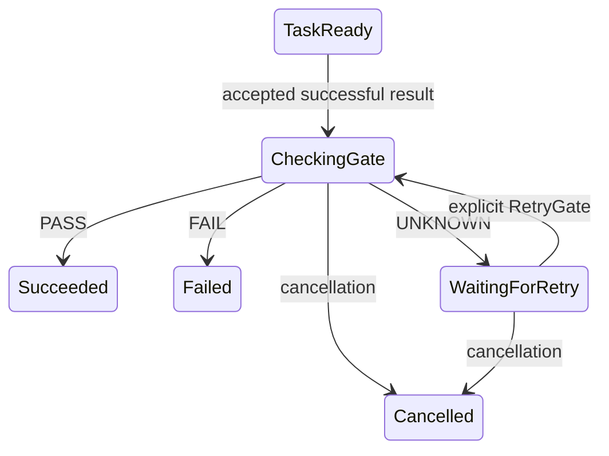

# Mandatory runtime postconditions

A successful worker invocation is an observation. A business step with a frozen
postcondition releases successors only after its own evidence decision is PASS.
A successful terminal can declare a separate postcondition, so a passing task
alone need not complete the business process. This integration uses the portable
[evidence checker](evidence-gates.md) without adding I/O to the kernel.

## Run the actual flow

```sh
cargo build --locked --bin workflow
python3 examples/gates/drive-guarded.py "$PWD/target/debug/workflow" /tmp/new-guarded-run
```

Use a new output directory. The example reads the inspected definition from an
actual Git commit, invokes `workflow.validate`, publishes a typed report and
settles its exact result. It asserts `running` after settlement, `running` after
the task gate, and `succeeded` after the terminal gate. The two gate drives invoke
no additional worker tasks. Saved snapshots, history and references expose each
boundary. The fixture's source literals are replaced with the inspected commit;
this is not a clean-workspace verification service.

## Freeze the contract before starting

`BundleSpec.postconditions` is optional for legacy bundles. Each entry identifies
an exact workflow and either a task or a successful terminal. It carries:

| Field | Contract |
| --- | --- |
| `workflow`, `node_id` | One postcondition per node in that workflow version |
| `policy` | Complete versioned mandatory requirements, including capability digest, report type, Boolean field and freshness |
| `action` | Exact business action ID/version being completed |
| `repository`, `revision` | String bindings for the target source identity |
| `input_node` | This task or an ancestor task whose resolved inputs define the common checked input digest |
| `artifacts` | Binding for an array of exact `{artifact_id, digest}` links |

Bindings use the IR's literal, workflow-input or node-output shape. Referenced
fields must be required and have the exact type. Outputs must come from the node
itself or an ancestor. A checker requirement names a task in the same workflow;
its contract and Boolean output must match. A checker cannot depend on the gated
node's completion. Parallel checkers are allowed. Every activated gate freezes
the checkers' **current frame instance IDs**, so another loop round's evidence
cannot satisfy it.

Use `workflow schema kernel-bundle` or `run-start` and `kernel check` before
`run start`. At most 256 postconditions fit within the existing 2 MiB bundle
budget; each policy permits 1–64 requirements. Policies, targets and observations
also consume the existing bounded snapshot/event/transition budgets. Bundle and
run digests include the postconditions. Existing runs reject changed starts;
policy ID/version binds one content digest across the database, as workflow and
capability versions already do. The host still owns which bundle may start a new
run. Do not remove requirements or create a new policy version to bypass an
existing task's authority.

## State and decisions



A successful terminal enters the same gate state when activated. While checking,
observed outputs are retained but unavailable to downstream bindings. Invalid
dynamic target data fails the node with `postcondition_target`; it preserves the
actual task observation rather than repeating work. A verified FAIL fails the
node with `postcondition_fail`. Existing declared subworkflow/loop semantics can
then make a fresh repair frame, with the declared iteration and total deadline
bounds. The gate does not invent a repair capability or reset a budget.

UNKNOWN records the full decision and leaves `CheckingGate { awaiting: false }`
with `postcondition_unknown`. Its outbox intent is consumed and future drives
return idle until an explicit retry intent or other applicable event. There is
no automatic retry loop. Enclosing loop deadlines and cancellation remain active.

```sh
workflow run --artifacts <store> status <db> <run-id>
workflow run --artifacts <store> retry-gate <db> <run-id> <instance-id> <event-id> <expected-revision>
workflow run --artifacts <store> drive <db> <run-id> <owner> <max-commands>
```

Use the observed UNKNOWN instance and revision. The retry freezes the same target
and schedules one check; it does not reexecute the checker. Repeating the same
intent identity returns the committed duplicate, including after consumption.
A changed instance conflicts. A parallel checker settling later can supply new
evidence for a retry; a missing attachment on an already settled task cannot be
retroactively appended. That case needs an authorized fresh repair run/frame or
cancellation, not repeated retries or edited history.

## Fenced local enforcement

Under the run lease, `claim_next` handles `CheckGate` internally. It recovers the
execution ledger and artifacts, selects settled results from the frozen checker
instances, and constructs the request. Exactly one attachment of the complete
expected report type must identify each role. Zero or multiple matches leave the
requirement without eligible evidence (UNKNOWN). The accepted worker Boolean is
the verdict source; an artifact's assertion cannot replace it.

The decision, kernel event/state, successor intents, receipt and `GateChecked`
execution record commit atomically. Immediately before commit, host time must
still precede lease expiry and, for PASS, the earliest evidence expiry. Expiry
rolls back the complete transaction. I/O failure loading retained artifacts also
aborts; storage does not persist an availability-based UNKNOWN that could change
meaning on later recovery. Missing eligible evidence in the execution prefix is
a durable UNKNOWN.

Recovery recomputes each historical decision at its recorded time from the exact
execution prefix, earlier kernel revisions and verified immutable artifacts. Later checker settlements do
not rewrite earlier decisions. Every gate event must have exactly one execution
proof and exact receipt. Forged decisions are rejected even if ordinary event and
snapshot hashes have been recomputed. Cancellation can consume an obsolete gate
intent without a decision, since it cannot release a successful transition.

Raw `run event` cannot submit `GateEvaluated`, and manual `acknowledge` cannot
consume a gate command. In a run containing postconditions, successful task
completion/reconciliation must enter through the fenced execution port; raw
success events are refused. Pure kernel replay remains a trusted simulation API.
Local database ownership, host clocks, worker ingress and reader implementations
are authority boundaries; this is not remote authentication or a signature.

## Compatibility, evidence and limits

Run storage schema **4** prevents older binaries from accepting the new protected
transition semantics. `run --artifacts <store> migrate <db>` upgrades schemas
1/2/3 transactionally after verifying every run. Evidence-bearing runs require
the reader during migration. Missing/corrupt dependencies roll back the version;
legacy empty postconditions and absent decisions preserve old canonical digests.
The artifact catalog remains schema 1 and the wire schema family remains v1 with
new variants/optional fields; clients must refresh generated schemas.

Cargo and Bazel tests cover both gates, replay/deduplication, raw ingress rejection,
actual false results despite true reports, UNKNOWN idle/retry, bounded three-round
repair and deadlines, context/instance/expiry changes, policy immutability,
precommit expiry rollback, corrupt proof detection, artifact read failures,
cancellation/takeover, independent process races and termination around commit.
The runnable example uses actual compiler execution. Process-crash checks do not
establish power-loss recovery or business benefit.

R03 remains open for current-workspace observation, authenticated remote facts,
human approvals/exceptions and a final acceptance manifest. An internal node PASS
cannot authorize an external write. An effect adapter must reobserve/revalidate
the target and atomically compare it when applying the action, with reconciliation
where that external service cannot close the race. The built-in driver does not
automatically publish reports; host/worker adapters must supply retained reports
when settling their actual results.
