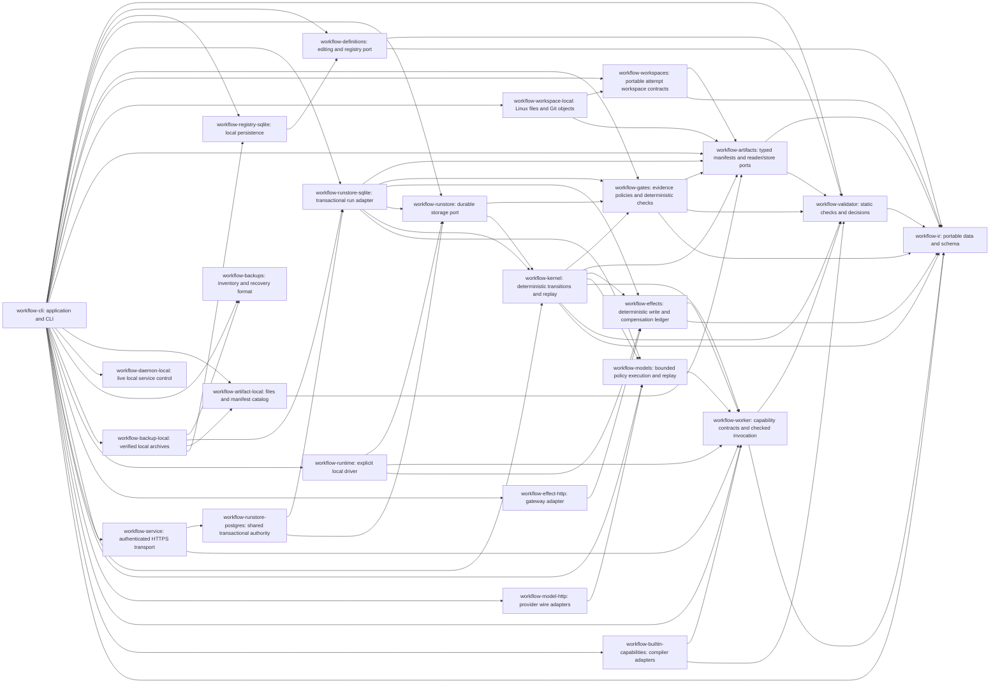

# Workflow 架构与交付

产品负责可移植业务流程契约、合法状态转换、显式证据和持久执行 ownership。模型提出节点内决策，capability 执行工作，skill 说明如何通过 CLI 正确使用能力。提供方 SDK 和数据库留在适配器中。

这些是具有显式 Bazel target 的独立 Rust 库。模型与能力适配器依赖稳定契约，IR 必须独立于这些实现。Cargo 与 Bazel 编译相同源码，使用同一外部依赖锁；Rust 和 Bazel 版本固定。

## Issue 顺序

每个 MR 都必须说明所完成 issue 的验收范围、测试及剩余工作。只有全部验收标准均有证据，才能关闭 issue。研究总议题仍代表完整路线图；完成编译器并不等于完成工作流 runtime。

| Issue | 交付情况 |
| --- | --- |
| [R01 #2](https://github.com/coolplayagent/workflow-cli/issues/2) | 已交付 IR、静态验证、决策、示例、乐观锁草稿/节点/边 CRUD、语义 diff、不可变发布与历史；确定性控制流、能力/子流程 bundle 检查、不可变 run 绑定和 checkpoint 回放；冻结模型策略解析和本地持久 dispatch；共享有界编译报告、真实 HTTPS 诊断一致性、首次启动前不可变远程发布，以及可复现 R01 基线。参见定义验收指南。 |
| [R02 #4](https://github.com/coolplayagent/workflow-cli/issues/4) | 已交付能力 descriptor/adapter port、protocol 1 request/grant/result 验证、独立/节点只读编译器调用；有界模型/工具循环、protocol 2 policy/record 绑定、显式回放、OpenAI Responses/Anthropic Messages 适配器及相同 bundle 替换 fixture；精确模型策略凭证 grant、远程模型 CLI、进程内/HTTPS 共用 TaskTransport、PolicyEvaluator 和十案例模型传输矩阵。本地/远程持久 effect 使用独立 grant。参见 [R02 验收](02-model-boundaries-acceptance.md)；沙箱协议 fixture 不代表在线模型质量或成本测量。 |
| [R15 #3](https://github.com/coolplayagent/workflow-cli/issues/3) | 随模块增量加入确定性不变量检查；独立业务基线和故障实验仍未完成。 |
| [R04 #5](https://github.com/coolplayagent/workflow-cli/issues/5) | 已交付 kernel 状态/事件/命令契约、取消/对账转换；RunStore port、SQLite 原子 state/event/checkpoint/outbox 提交、有序交付回执、持久 CLI、CAS/崩溃/损坏/磁盘满测试；run lease、epoch fencing、持久 attempt、原子结果/事件/回执、有界只读重试和显式迁移，完成/恢复前验证产物；持久暂停/恢复准入、在途结果排空与原截止时间恢复；冻结写策略、effect intent/receipt 账本、提供方查询恢复、有界 backoff、人工对账和 HTTP 故障测试；显式有序补偿、原回执绑定、不可逆契约及撤销失败后持久人工接管；一致本地备份、产物/定义保留、恢复 ownership generation 和备份后 effect query/import；可选本地 daemon 和持久 timer 扫描；共享 PostgreSQL authority、认证 HTTPS 只读任务和 effect dispatch/query/审计对账；完整 PostgreSQL archive/restore 验收、原子依赖验证、旧凭证撤销、新 generation 及认证备份后 effect 导入。参见 [R04 验收](../05-shared-execution/07-shared-recovery.md)。 |
| [R05 #6](https://github.com/coolplayagent/workflow-cli/issues/6) | 已交付本地及认证共享 effect 执行、稳定 key、持久 intent/receipt、query-first 恢复、有界重试、有序补偿和审计人工接管。[远程 effect 验收](../05-shared-execution/05-remote-effects.md) 将每条标准映射到本地及真实 PostgreSQL/HTTPS 故障证据。提供方保证始终显式，不承诺全局 exactly-once。 |
| [R07 #7](https://github.com/coolplayagent/workflow-cli/issues/7) | 已交付类型化且绑定来源的产物、本地/S3 原子发布、共享 PostgreSQL 对象 catalog、作用域短期下载、血缘保留和崩溃安全孤儿清理。实际任务分配独立工作区，记录可执行/工具身份，在结算前捕获类型化证据。封存提案支持审核冲突选择、新的已验证 Git revision 和新 gate 证据；替代 plan 拒绝过时传递证据并保留历史。参见 [R07 验收](04-artifact-acceptance.md)。 |
| [R11 #8](https://github.com/coolplayagent/workflow-cli/issues/8) | 已交付不可变版本路由；带审核影响、新 instance/证据/审批、timer 转换和 fencing 原子提交的显式暂停 run 迁移；保留版本下历史回放；已验证本地备份/存储升级与作用域共享 image 转换。真实进程崩溃、PostgreSQL/HTTPS、CLI 和保留二进制恢复见 [R11 验收](../04-effects-and-recovery/05-version-migration.md)。 |
| [R03 #10](https://github.com/coolplayagent/workflow-cli/issues/10) | 已交付可移植 PASS/FAIL/UNKNOWN 检查器，精确 policy/target/tool/input 绑定、已结算执行来源与只读 CLI 重新验证；冻结的强制 task/terminal postcondition、fencing 决策提交/回放、持久 UNKNOWN 重试和声明的有界修复；持久 callback Inbox、提前/暂停缓冲、精确 target/input 匹配和事务去重；动作专属 gate 消费、当前工作区验证、作用域人工例外及最终验收清单。参见 [R03 验收](../03-execution-and-evidence/09-release-acceptance.md)。 |
| [R06 #11](https://github.com/coolplayagent/workflow-cli/issues/11) | 冻结 responder/subject/validity 与例外策略、独立认证人工/事件角色、持久 Inbox/timer、返工失效、回放，以及本地/PostgreSQL/HTTPS 故障覆盖。参见 [R06 验收](03-approval-acceptance.md)。 |
| [R08 #12](https://github.com/coolplayagent/workflow-cli/issues/12) | 已交付具有真实内置能力结果的显式本地只读 drive 和持久暂停/恢复；已验证本地 backup/restore、移动路径、旧 lease fencing 和显式外部 effect recovery hold；可查询/停止的可选本地 daemon、重启/挂起恢复、并发 CLI ownership 测试及完整离线 branch/loop/parallel/approval 示例。独立环境验证随 daemon MR 保留。 |
| [R14 #9](https://github.com/coolplayagent/workflow-cli/issues/9) | 针对注册 builtin/model/effect 执行，已交付认证 tenant/project/actor/角色边界、精确 worker grant、绑定 assignment 的短期提供方凭证及实时轮换、已知凭证回显拒绝、作用域私有审计导出、受保护产物下载、隔离工作区和显式保留/归档/删除策略。真实 PostgreSQL/HTTPS 与提供方验收包含跨 scope 和恶意输出反例。参见 [R14 验收](06-security-acceptance.md)。 |
| [R09 #13](https://github.com/coolplayagent/workflow-cli/issues/13) | 已交付 PostgreSQL authority、主数据库时间、不可变绑定、作用域身份/角色、撤销/审计和 task assignment。认证 HTTPS 与主机 secret reference 连接独立 scheduler/worker；双 scheduler、三 worker 故障测试证明更高 epoch 接管、过时结果拒绝和本地/远程业务状态一致。还包括有界续租、共享配额/背压、worker 路由/排空与故障接管。完整测试边界见 [R09 验收](../05-shared-execution/06-cluster-scheduling.md)，生产性能需另测。R14 安全边界单独记录；认证 effect dispatch/对账和类型化暂停/恢复/取消已实现。 |
| [R13 #14](https://github.com/coolplayagent/workflow-cli/issues/14) | [已审核 SDLC 模板](../02-process-definition/05-reviewed-templates.md)：可移植定义、独立 owner 发布、纯 plan 和本地/TLS 回归产物。 |
| [R10 #15](https://github.com/coolplayagent/workflow-cli/issues/15)、[R12 #16](https://github.com/coolplayagent/workflow-cli/issues/16) | 混合部署与成本/可观测性。 |
| [R16 #17](https://github.com/coolplayagent/workflow-cli/issues/17) | 离线候选学习、held-out 评估及强制 gate 保持。 |

## R01 验收证据

精确命令、覆盖范围和测量限制见[定义验收指南](01-definition-acceptance.md)。

| 要求 | 证据与剩余边界 |
| --- | --- |
| 共用版本化 JSON/YAML/builder IR | `workflow-ir` 往返、摘要、类型测试；生成 JSON Schema 与源码一致性检查 |
| 审核、并行测试、有界修复、拒绝示例 | 编译器 fixture、五个 CLI 回放场景及 kernel 结果测试；场景中的外部任务结果是模拟值 |
| 未知引用、循环、可达性、边界与输入类型 | Validator/bundle 反例；契约/引用在提供的 bundle 内解析，外部适配器可用性由主机检查 |
| Condition 缺失/类型/多匹配/无匹配 | 确定性 evaluator 和 kernel 测试，包括 join 失败/skip/cancel 和实际值缺失 |
| 本地/远程边界验证相同 | 18 案例真实 HTTPS/PostgreSQL 诊断矩阵、CLI 字节一致性、认证 HTTPS 内置工作流执行一致性 |
| 编辑、乐观冲突、发布、语义 diff | `workflow-definitions` 和 SQLite 测试；完整 CLI 创作循环；OS 进程竞态和中断事务恢复。bundle 检查及 definition/capability 摘要锁定 kernel run；远程发布在首次启动前冻结相同不可变版本身份；共享远程草稿 CRUD 是独立创作扩展。 |
| 能力绑定边界 | `workflow-worker` 检查精确能力版本/摘要、节点输入/输出契约与前置条件；内置编译器能力可独立或通过已准备节点请求运行。kernel 检查 bundle、归约可信主机事件；SQLite run 提交、本地 ownership/只读 dispatch、认证 assignment/result 入口、远程 artifact/effect 执行、远程模型执行和精确 policy grant 均已实现。 |
| 控制流 runtime | `workflow-kernel` 测试顺序、决策、all/any、wait、子流程值和有界循环；checkpoint 恢复保留截止时间/instance。SQLite 持久保存转换，本地只读 dispatch 由真实 builtin 执行测试覆盖。 |
| 价值基线 | `examples/validation/baseline.py` 记录植入无效图检出、10 个 CLI 编辑样本及 29 个预期回放步骤；HTTPS 矩阵补充远程检出/一致性数量。这些是有界 fixture 基线，不是人工效率或生产业务收益测量。 |

## 历史增量证据

以下按契约引入顺序保留历史。有关“剩余工作”的陈述描述对应增量，并非当前版本。当前范围以上方交付表及链接的验收章节为准。

### R04 首个增量证据

[运行存储指南](../03-execution-and-evidence/01-run-store.md) 定义 RunStore port、SQLite 契约和被测试崩溃模型。原子 start/apply/receipt 事务、不可变绑定锁、事件去重、CAS、保留 wait/loop frame 和完整恢复均有契约测试。独立进程在提交前后被终止；SQLite 磁盘满/只读失败不会输出成功。恢复时比较 checkpoint 加 tail、完整历史、当前状态及每个 outbox intent。

[本地执行指南](../03-execution-and-evidence/02-local-execution.md) 加入 run lease、attempt、epoch fencing、有界只读重试和原子结果结算。之后又增加托管 effect 账本/重试及产物验证。本地 daemon 和远程 scheduler 扫描持久 timer；PostgreSQL 提供共享事务存储。已验证本地备份覆盖保留定义/产物及恢复 ownership。共享产物持续保留；完整 PostgreSQL archive/restore 和 held ownership 恢复已有[可执行验收](../05-shared-execution/07-shared-recovery.md)。进程恢复证据不能证明整盘灾难恢复或 RPO/RTO。

### R07 产物增量证据

[产物指南](../03-execution-and-evidence/05-artifacts.md) 定义可移植 manifest 身份、类型化内容、精确生产者来源及保留输入依赖。本地发布在 manifest 提交前同步内容，与孤儿清理使用同一 catalog 锁。进程终止测试覆盖部分上传到提交后恢复；并发发布者去重而不覆盖，存储失败不确认产物。真实 CLI worker 结果可以提交已检查报告，在移动后的 store 中用相同引用恢复。缺失/损坏依赖和错误输入来源被拒绝。lineage/impact 查询识别受影响下游生产者，不重写历史。该增量尚未完成隔离工作区、远程对象存储/认证或受控重新计算验收。

### R03 证据检查器增量

[证据检查器指南](../03-execution-and-evidence/07-evidence-gates.md) 定义精确要求、目标绑定、来源义务和不含截止点的新鲜度窗口。核心与真实 CLI 测试拒绝过时/缺失/未提交/不匹配证据及伪造决策字段；即使报告声称 true，真实编译器 false 输出仍为 FAIL。独立评估不推进 run，也不授权 effect。

[runtime postcondition 增量](../03-execution-and-evidence/08-runtime-postconditions.md) 在 bundle 中冻结强制 task/terminal 契约，在放行后继节点前检查已结算证据，在租约下提交决策，恢复时重查证明。UNKNOWN 持久保存，直到显式重试前保持空闲；确认 FAIL 进入声明的有界修复。测试覆盖三轮耗尽/截止时间、原始入口拒绝、提交前过期回滚、进程竞态/崩溃与迁移。该阶段 R03 的工作区验证、原子外部动作消费、人工例外及最终验收清单仍待完成。

### R07 attempt 工作区增量

[工作区指南](../03-execution-and-evidence/06-workspaces.md) 定义 attempt 身份、固定 Git 对象验证、独立可写文件、确定性观察和类型化输出捕获。真实 CLI 示例证明分配字节等于已准备 validator 输入，结算捕获证据并完成两个已有 gate。并发进程分配、崩溃清理、对象损坏及 SQLite 容量测试覆盖失败边界。目录隔离不是 OS 沙箱；该阶段自动 run/gate 绑定、共享资源协调、合并和远程授权仍待完成。

### R02 模型策略增量证据

[模型执行](../03-execution-and-evidence/04-model-execution.md) 定义策略、提供方绑定、protocol 2 和显式回放边界。可移植执行器约束工具与输出，提供方适配器负责 HTTP 与凭证查询。loopback HTTP 测试用两种提供方格式和实际编译器工具运行相同业务 bundle。持久结算拒绝缺失/篡改记录、过时 owner 和原始成功事件；恢复不调用模型，缺少证据时强制 gate 保持 UNKNOWN。真实 schema 4 数据库升级到 5，snapshot/execution history 相同，旧 reader 的拒绝得到验证。不承诺在线提供方、模型质量、exactly-once 计费或 run 总金额预算。[R02 验收指南](02-model-boundaries-acceptance.md) 记录已完成组件与传输契约。

#### Effect 账本增量

`workflow-effects` 负责与提供方无关的账本；`workflow-effect-http` 实现显式 gateway dispatch，二者均为 Cargo/Bazel Rust 库。[effect 契约](../04-effects-and-recovery/02-durable-effects.md) 描述已测试本地行为；远程验收指南补齐 R05 证据映射。测试证明 fixture 在沙箱提供方边界去重，不代表全局 exactly-once。

[有序补偿](../04-effects-and-recovery/03-ordered-compensation.md) 加入显式逆向业务依赖、原资源回执、不可逆标记及清理失败后人工接管。提供方故障测试保留已完成补偿，并查询中断的最终撤销。[远程 effect 验收](../05-shared-execution/05-remote-effects.md) 覆盖共享执行/对账；动作专属 gate 消费是独立 R03 义务。

[备份恢复](../04-effects-and-recovery/04-backup-recovery.md) 提供一致本地 run image、不可变产物闭包、保留 registry 历史和带 fencing 的恢复。快照可能早于外部写入；恢复 run 在显式操作者对账前，查询已知 intent 或导入原审计回执。小 fixture 实测恢复时间不含人工/提供方恢复。

### 认证共享产物增量

[共享产物指南](../05-shared-execution/04-shared-artifacts.md) 描述 PostgreSQL 内容存储、有界续传、作用域授权，以及已验证结果/恢复集成。真实 PostgreSQL/HTTPS fixture 覆盖上传进程丢失、凭证/租约 fencing、输入血缘、损坏和保留内容清理。该增量本身不提供 S3 传输、独立工作区测量、完整共享保留/备份策略、沙箱或 secret grant。[R14 验收](06-security-acceptance.md) 现已定义受支持执行边界、broker lease、保留策略及审计导出；任意命令执行不是所提供的能力。

<!-- book-navigation -->

6.8 架构与交付路线图

[全书目录](../README.md) · [6. 验收与维护](README.md) · [English](../../en/06-acceptance-and-maintenance/08-roadmap.md) · [上一章: 6.7 故障排查与贡献](07-troubleshooting.md)

<!-- /book-navigation -->
