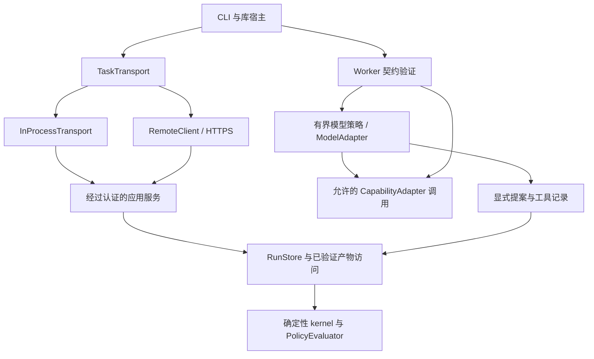

# R02 组件与模型执行验收

工作流定义固定节点契约、策略身份、合法边和 gate；主机绑定选择模型提供方及实现。提供方响应和传输响应都不能直接提交状态。run store 重建已分配请求、检查当前 ownership，并在接受完成前回放显式模型记录。

## 可替换接口

| 组件 | 公共接口 | 实现 / 使用方 |
| --- | --- | --- |
| DefinitionRegistry | `workflow_definitions::DefinitionRegistry` | SQLite registry、CLI 创作 |
| RunStore | `workflow_runstore::RunStore`、`ExecutionStore` | SQLite 与 PostgreSQL；本地 driver 与认证服务 |
| ArtifactStore | `workflow_artifacts::ArtifactStore`、`ArtifactReader` | 本地文件；assignment 范围内共享传输及已验证证据 |
| TaskTransport | `workflow_service::TaskTransport` | `InProcessTransport`、`RemoteClient`；scheduler、task/effect worker 循环 |
| Worker | `workflow_worker::Worker` | 单独执行、本地及远程执行共用的检查后适配器注册表 |
| ModelAdapter | `workflow_models::ModelAdapter` | 确定性 fixture、OpenAI Responses、Anthropic Messages |
| CapabilityAdapter | `workflow_worker::CapabilityAdapter` | 内置编译器工具与主机注册实现 |
| PolicyEvaluator | `workflow_gates::PolicyEvaluator` | `DeterministicPolicyEvaluator`；持久的强制 postcondition |



核心 crate 依赖图见[架构指南](roadmap.md)。kernel 不依赖提供方实现，只使用可移植模型记录验证，回放时不调用提供方。

`InProcessTransport::new(service, credential_ref)` 接受与 `RemoteClient` 相同的版本化 `Request`。两者都检查请求边界、响应匹配和凭证形状，每次调用重读凭证，隐藏应用错误细节，并且不自动重放修改操作。两者调用 `Request::execute` 和同一个作用域认证服务。进程内适配器仍使用共享 authority store；独立 SQLite 执行则通过 `ExecutionStore` driver 提供。更换传输不会让 worker 变成可信状态写入者，也不能绕过已撤销凭证。

## 版本与权限兼容性

| 接口面 | 支持版本与协商规则 |
| --- | --- |
| HTTPS / 进程内应用 envelope | 版本 1，其他版本在 dispatch 前拒绝 |
| 直接 worker request/grant/result | 版本 1，由 `capability list` 公告 |
| 模型 worker request/grant/result | 版本 2，由 `model check-policy` 公告；要求精确策略绑定和显式记录 |
| 模型 policy/proposal/record | schema 1；未知 proposal 动作与字段被拒绝 |
| Capability | 精确 ID、固定版本及 descriptor digest；语义改变需新版本 |

选择过程为显式能力公告加精确版本接受，不静默降级。分配 protocol 2 工作前，应先部署支持模型的 server 和 worker；旧的仅支持直接执行的 worker 无法完成。envelope 仍为版本 1，因为其操作/响应形状已经能携带 worker protocol 2。新增可选 `CapabilityRule.model_policy` 对模型 assignment 是必需的；普通能力 grant 不再隐含模型策略 grant。旧配置二进制会拒绝新字段。已有直接 grant 的序列化表示与含义不变。

使用 `model check-policy` 返回的 `task_contract_digest` 和 `binding` 配置 worker 规则。policy digest 绑定目标、允许工具、完整契约与预算。提供方、端点和密钥引用仍在主机配置中。不同提供方绑定不会改变业务 bundle。本地与远程命令见[模型指南](model-execution.md)。

模型只能动态调用当前策略显式允许的只读契约。声明为写入的契约不能注册为模型工具。模型不能请求其他节点状态转换，也不能跳过 UNKNOWN gate。写入节点使用独立的[持久 effect 协议](remote-effects.md)，每次调用都检查冻结目标、主体、输入、租约和 effect 权限。模型结果可为声明的后继节点提供类型化数据，但不是 effect grant。任意嵌套写入工具会被明确拒绝；此实现不承诺可从崩溃恢复的中间模型会话。适配器声明是可信主机边界；[R14](security-acceptance.md) 定义注册执行器、工作区隔离边界和特权自定义适配器要求。

## 验收证据

| Issue 标准 | 可执行证据 |
| --- | --- |
| 同一工作流、两种模型适配器和确定性执行器 | `https_model_bindings_records_failures_and_policy_authority_contract` 用 fake adapter 和两种 HTTP wire adapter 执行不变业务 bundle；差异仅在 worker 绑定 |
| 单独执行和工作流使用相同能力契约 | 同一测试比较独立验证输出与模型工具/工作流输出；worker 测试覆盖精确 node/descriptor 匹配 |
| 相同本地与远程传输案例 | 完整模型契约同时运行于 `InProcessTransport` 和真实 HTTPS，包括认证 dispatch、独立进程 worker、结果结算及重开 |
| 拒绝无效 result/protocol/capability/transition | 传输版本拒绝、无 run 变更的模型策略授权拒绝、缺失记录拒绝、非法 proposal fixture、缺失工具/改变契约的 worker 与模型测试 |
| 提供方故障与已提交状态隔离 | 503 产生已记录的模型失败；重开后已提交 run 保持相等；独立确定性能力仍成功；恢复不增加提供方调用 |
| 依赖图、协议和替换示例 | 上述接口表与图；[worker 协议](worker-protocol.md)；`examples/models/{openai,anthropic}.json` 及下方可执行 CLI 示例 |

同一矩阵还检查错误 worker 访问、凭证撤销、策略身份不变、类型化输出相等、可见决策/工具结果保留，以及持久 image 中没有凭证或隐藏推理 fixture 内容。SQLite 测试另行证明租约 fencing、不可变策略版本、精确记录回放，以及强制 UNKNOWN postcondition 的保留。

```sh
cargo test -p workflow-worker -p workflow-models -p workflow-model-http -p workflow-gates --locked
cargo test -p workflow-runstore-sqlite --locked models
# WORKFLOW_TEST_POSTGRES 必须指向可丢弃数据库。
cargo test -p workflow-service --locked https_model_bindings_records_failures_and_policy_authority_contract -- --ignored --nocapture
cargo build -p workflow-cli --locked
python3 examples/models/https-cli.py target/debug/workflow
```

CLI 示例创建唯一 tenant、启动真实 TLS 服务与本地提供方 wire fixture、签发精确策略 grant，然后用每种提供方绑定执行 `remote work-models`。它断言业务输出相等、观察到四次提供方调用，报告**零次业务定义修改**和测试二进制摘要。Rust CI 执行单元契约；PostgreSQL CI 执行传输矩阵与 CLI 示例。完整仓库门禁还包含 Clippy、格式、workspace 测试和 Bazel。

这些是确定性协议与权限测量，不衡量在线提供方可用性、模型质量、提供方账单或人工集成时间。相关运维评估可以使用相同绑定接口，无需改变工作流定义。

<!-- book-navigation -->

[目录](README.md) · [English](../model-boundaries-acceptance.md) · [上一章: 流程定义验收](definition-acceptance.md) · [下一章: 审批验收](approval-acceptance.md)

<!-- /book-navigation -->
