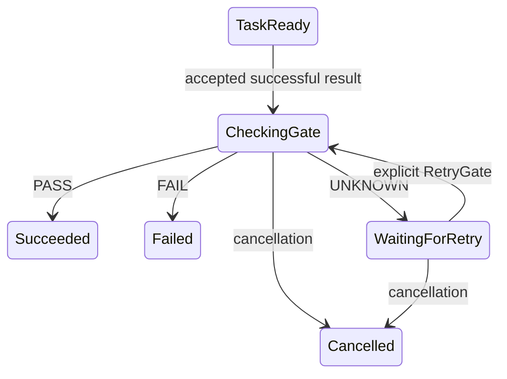

# 强制运行时后置条件

Worker 调用成功是一次观察。带冻结后置条件的业务步骤，只有自身证据为 PASS，或存在另行授权、明确
记录且范围匹配的例外时，才能放行后继。成功终点可声明独立后置条件，所以任务通过不一定使整个业务
完成。本集成使用可移植[证据 checker](evidence-gates.md)，不在内核增加 I/O。

## 执行真实流程

```sh
cargo build --locked --bin workflow
python3 examples/gates/drive-guarded.py "$PWD/target/debug/workflow" /tmp/new-guarded-run
```

使用新输出目录。示例从真实 Git 提交读取定义，调用 `workflow.validate`，发布类型化报告并提交准确
结果，断言任务提交后仍 `running`、任务门禁后仍 `running`、终点门禁后才 `succeeded`。
两次门禁 drive 不执行新 worker 任务。保存的快照、历史和引用展示各边界。测试中的源码字面值替换为
被检查提交，这不是干净工作区验证服务。

## 启动前冻结契约

旧 bundle 可省略 `BundleSpec.postconditions`。每个条目指定准确流程及一个 task 或成功 terminal，包含：

| 字段 | 契约 |
| --- | --- |
| `workflow`、`node_id` | 同一流程版本中每个节点最多一个后置条件 |
| `policy` | 完整版本化强制要求，包括能力摘要、报告类型、布尔字段和有效期 |
| `action` | 正在完成的准确业务动作 ID/version |
| `repository`、`revision` | 目标来源身份的字符串绑定 |
| `input_node` | 当前任务或祖先任务，其解析输入定义共用检查摘要 |
| `artifacts` | 准确 `{artifact_id, digest}` 数组绑定 |
| `exception` | 可选的先前人工 wait 与摘要主题，保留原非 PASS 结论 |

绑定使用 IR 的字面值、流程输入或节点输出形状。引用字段必须必填且类型准确；输出来自本节点或祖先。
Checker 要求指定同一流程中的任务，契约与布尔输出匹配，不能依赖被门禁节点已经完成。允许并行
checker。每次激活门禁都冻结 checker 的**当前 frame 实例 ID**，其他循环轮次的证据不能满足它。

`run start` 前使用 `workflow schema kernel-bundle` 或 `run-start` 以及 `kernel check`。
最多 256 个后置条件，仍受 bundle 2 MiB 限制；每个策略 1–64 个要求。策略、目标和观察同时消耗既有
快照/事件/变更预算。Bundle 与运行摘要包含后置条件。已有运行拒绝变化后的 start，策略 ID/version
与流程、能力版本一样在数据库内绑定唯一内容摘要。宿主仍决定哪些 bundle 可启动新运行；不能删除
要求或创建新策略版本绕过原任务权限。

## 状态与决策



成功终点激活时进入相同门禁状态。检查期间保留观察输出，但下游绑定不可读取。动态目标无效使节点以
`postcondition_target` 失败，保留真实任务观察，不重复工作。验证过的 FAIL 以 `postcondition_fail`
失败，已有子流程/循环语义可创建新修复 frame，但保留迭代上限和总 deadline。门禁不虚构修复能力，
也不重置预算。

UNKNOWN 记录完整决策，以 `postcondition_unknown` 留在 `CheckingGate { awaiting: false }`。
Outbox 意图被消费，后续 drive 返回 idle，直到明确重试或其他适用事件。没有自动重试循环，外层循环
deadline 与取消仍有效。

```sh
workflow run --artifacts <store> status <db> <run-id>
workflow run --artifacts <store> retry-gate <db> <run-id> <instance-id> <event-id> <expected-revision>
workflow run --artifacts <store> drive <db> <run-id> <owner> <max-commands>
```

使用观察到的 UNKNOWN 实例和 revision。重试冻结相同目标并调度一次检查，不重新执行 checker。
相同意图身份重复提交返回已提交 duplicate，消费后也如此；实例变化则冲突。稍后完成的并行 checker
可提供新证据；已提交任务缺失附件不能事后追加。这种情况需要有权启动新的修复运行/frame 或取消，
不能不断重试或编辑历史。

## 受所有权约束的本地执行

`claim_next` 在运行租约下内部处理 `CheckGate`：恢复执行账本和产物，选择冻结 checker 实例的已提交
结果并构造请求。每个角色必须恰有一个完整预期报告类型的附件；零个或多个都没有合格证据，为 UNKNOWN。
结论源是已接纳 worker 布尔输出，产物自称结果不能替代。

决策、内核事件/状态、后继意图、回执和 `GateChecked` 执行记录原子提交。提交前宿主时间必须仍早于
租约到期；PASS 还必须早于最早证据过期。过期回滚整个事务。读取保留产物发生 I/O 错误也中止，避免把
可能随恢复变化的可用性问题持久化为 UNKNOWN。执行前缀内缺少合格证据才是持久化 UNKNOWN。

恢复按记录时间、准确执行前缀、较早内核 revision 和已验证不可变产物重算历史决策；后续 checker
完成不改写早期结论。每个门禁事件必须有唯一执行证明和准确回执。即使重算普通事件/快照摘要，伪造
决策仍被拒绝。取消可以消费已无用 gate 意图而不产生决策，因为它不能放行成功变更。

原始 `run event` 不能提交 `GateEvaluated`，手工 `acknowledge` 不能消费 gate 命令。含后置条件的运行，
任务成功/核对必须通过受所有权约束的执行端口，拒绝原始成功事件。纯内核 replay 仍是可信模拟 API。
本地数据库所有权、宿主时钟、worker 接入和 reader 实现是权限边界，不等于远程认证或签名。

## 兼容性、证据与限制

运行存储为 schema **11**。[版本迁移](version-migration.md)要求验证备份和来源 CAS 后显式升级。
带证据运行在迁移时需要 reader；缺失/损坏依赖拒绝升级。旧版省略可选字段时保留原规范摘要，旧版
封闭 schema 二进制拒绝新的受保护契约。产物目录仍为 schema 1，线路 schema 族仍为 v1，但新增变体/
可选字段，客户端必须刷新生成的 schema。

Cargo/Bazel 测试覆盖两级门禁、回放/去重、原始接入拒绝、报告为真但真实结果为假、UNKNOWN idle/重试、
三轮有界修复与 deadline、上下文/实例/过期变化、策略不可变、提交前过期回滚、证明损坏、产物读取失败、
取消/接管、独立进程竞争及提交边界终止。可运行示例使用真实编译器，进程崩溃测试不证明断电恢复或业务收益。

[受保护发布与验收契约](release-acceptance.md)增加当前写授权、共享认证证据、范围限定审批/例外、真实
本地工作区观察和最终清单。内部节点 PASS 不能单独授权外部写入。内置 driver 不自动发布报告，由宿主/
worker 适配器在提交真实结果时提供保留报告。

[工作区端口与本地适配器](workspaces.md)提供独立 attempt 文件和当前观察，其示例把真实捕获报告提供给
这些门禁。受保护 HTTP 绑定还能在写分发前验证宿主管理的 Git 工作区，并明确声明剩余非原子竞争。

<!-- book-navigation -->

[目录](README.md) · [English](../runtime-postconditions.md) · [上一章: 证据门禁](evidence-gates.md) · [下一章: 受保护的交付](release-acceptance.md)

<!-- /book-navigation -->
